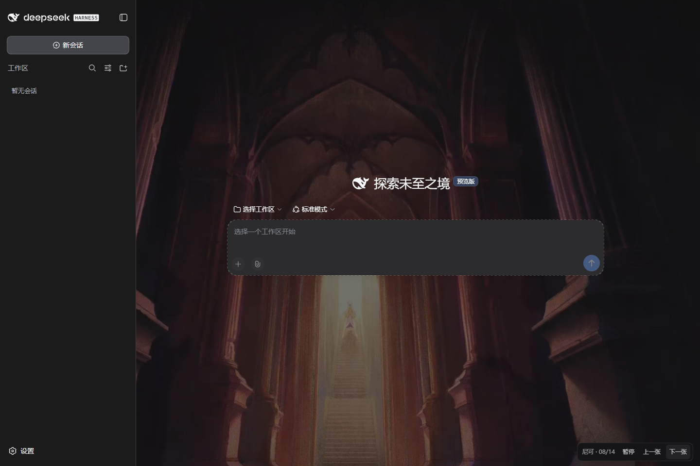
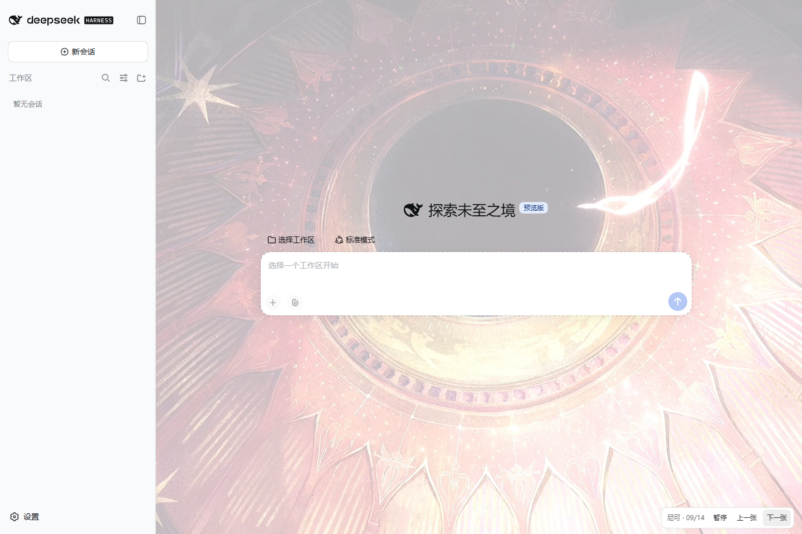
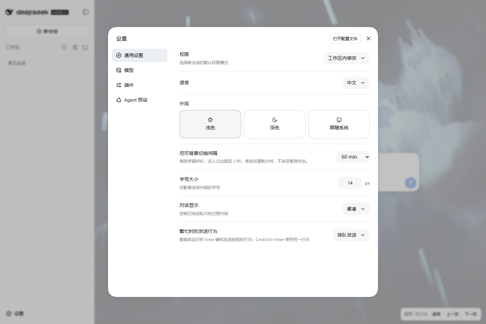

# 原神 · 尼可｜DSH 背景皮肤

把尼可角色 PV《缄口的金弦》里的画面放进 DeepSeek Harness。14 张背景按顺序轮换，每次用两秒慢慢淡入淡出，没有声音，也不播放视频。

背景会跟着 DSH 的浅色、深色设置走。聊天、输入框、侧栏和设置还是原来的用法，装上后不用重新调整主题。

**AI 制作说明：本项目的原创代码、样式、脚本、测试和文档均由 AI 助手 Codex 根据作者提出的需求生成、修改和整理，构建与打包也由其借助工具完成。背景图来自《原神》官方 PV，由 Codex 完成截图与裁切，不属于 AI 原创美术；第三方依赖仍归各自作者所有。**

## 效果

深色模式：



浅色模式：



截图来自实际 DSH 页面。当前版本为 **0.3.5**：播放条悬浮覆盖；进入已有消息的会话时，输入区外圈让出底色、露出背景，各卡片自身表面保持不变。背景、轮播顺序和切换时间没有改动。

## 能做什么

- 14 张 PV 截图循环播放，字幕和右上角标识所在的黑边已裁掉。
- 右下角可以暂停、继续，也可以手动切到上一张或下一张。喜欢某一张，暂停留下就好。
- 切换间隔可选 **1、5、10、30、60 分钟**，默认 1 分钟；淡入淡出固定为 2 秒。
- 记住当前图片、暂停状态和间隔，刷新页面后接着用。
- 图片随插件打包，装好后不需要联网加载背景。

背景调淡了一些，输入框、菜单、侧栏和代码块保留原来的底色。切到别的标签页时会暂停自动换图；系统开启「减少动态效果」时，默认暂停，手动切图也不加动画。

## 安装

先确认 DSH Web 能正常启动，并且已经安装了 DSH 插件管理需要的 pnpm。这是 Web 界面的皮肤，不改变终端界面。

下载 [0.3.5 安装包](release/dsh-skin-genshin-nicole-0.3.5.tgz)，不用解压。在安装包所在文件夹打开终端，运行：

```powershell
dsh plugin --profile web add "./dsh-skin-genshin-nicole-0.3.5.tgz"
```

安装后重启 DSH，再刷新浏览器，背景就会出现：

```powershell
dsh web
```

如果下载的是整个仓库，在仓库根目录安装时，路径写成 `./release/dsh-skin-genshin-nicole-0.3.5.tgz`。如果你用的 profile 不叫 `web`，把命令里的 `web` 换成自己的名称，并用平时启动该 profile 的方式打开 DSH。

安装成品不需要编译源码，也不需要为皮肤配置 API key。目前通过本地 `.tgz` 包安装，尚未发布到 npm。请先停用其他背景皮肤；如果装过 Nicole Lite，也请先卸载 Lite，避免两层背景叠在一起。

## 使用

播放按钮悬浮在右下角，不占用聊天和输入区的空间。输入区占住右下角时，会先隐去「尼可 · x/14」计数、收窄按钮，仍留在右下角输入区右侧；窗口更窄（包括竖屏）、横排无处可放时改为竖排，悬在输入区上方，始终不遮输入框和发送按钮。隐藏计数只影响这条播放条，不挪动输入框或统计栏。暂停只停止自动换图，仍然可以点「上一张」「下一张」；已经开始的淡入淡出会正常结束。

想让背景停留久一点，打开 **设置 → 通用设置 → 尼可背景切换间隔**。修改后重新计时，不会立刻跳到别的图片，也不会取消暂停。



明暗模式仍在 DSH 原来的外观设置里选择，皮肤不会强制改成深色。播放偏好只保存在当前浏览器、当前站点，换浏览器或清理站点数据后需要重新设置。

## 卸载

```powershell
dsh plugin --profile web remove dsh-skin-genshin-nicole
```

重启 DSH 并刷新页面即可恢复原来的背景，不会删除聊天记录。

## 兼容与开发

已在 Windows、DSH `0.1.2-rc.1` 和 Chrome 上测试过安装、轮播、明暗切换、窄屏及卸载。其他 DSH 版本、Firefox 和 Safari 尚未实测，请使用支持 `:has()` 和 `color-mix()` 的现代浏览器。

想自己改图片或调整样式，需要 Node.js 22.19 或更高版本：

```powershell
npm ci
npm test
npm run pack:release
```

新的安装包会生成在 `release/`。源码在 `src/`，截图素材在 `assets/`，构建结果在 `lib/`。更多说明见 [开发与测试](docs/development.md)。

## 素材与致谢

背景取自[原神官方尼可角色 PV《缄口的金弦》](https://www.bilibili.com/video/BV1cX516vEu8/?p=1)。取帧时间、裁切方式和素材校验值见 [ASSETS.md](ASSETS.md)。

接入方式参考了 DeepSeek Harness 官方实现，以及 dsh-themes、deepseek-harness-themes 和 dsh-ui-beautify。README 的组织方式参考了 [Genshin-odette-skin-dsh](https://github.com/lkdx0220/Genshin-odette-skin-dsh)；没有使用它的代码或图片。

本项目是非官方同人皮肤，与米哈游、HoYoverse、DeepSeek 没有隶属或授权关系。代码使用 [MIT 许可](LICENSE)，角色、视频及相关美术素材的权利归各自权利人，**不包含在 MIT 授权中**。本项目用于个人学习和非商业换肤，不代表已获得素材再分发许可。
