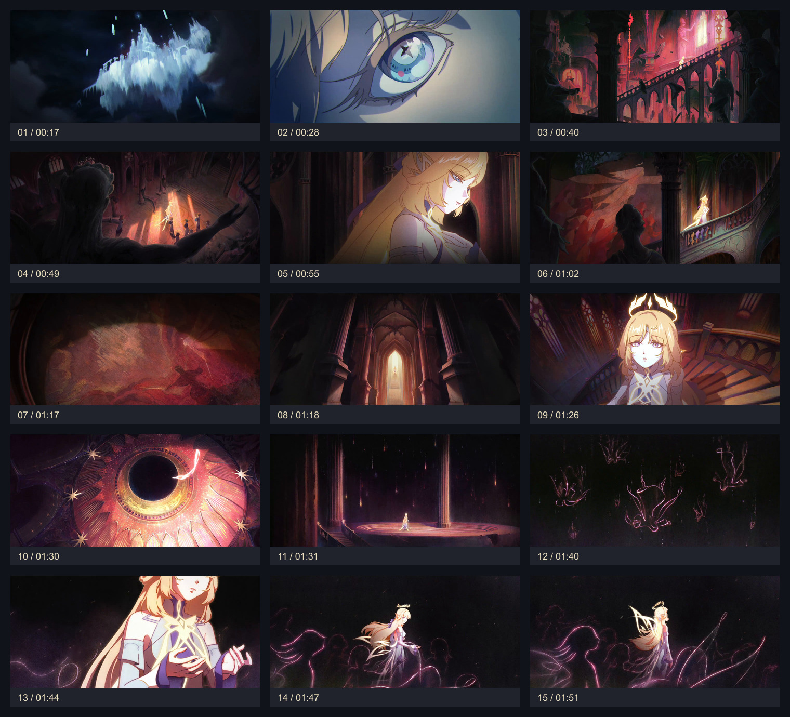

# 尼可 PV 干净背景素材

15 张图片来自同级 `../nicole-pv-frames/` 的原始截图，顺序及时间不变。

- 每张上下各裁掉 108 px，移除黑边内的字幕与右上角标识。
- 输出尺寸统一为 1920 × 864；未裁掉左右画面，未重绘、修补或调色。
- PNG 为保留内部原像素的母版；同名 WebP 是质量 94 的安装包用压缩副本。
- `manifest.json` 记录来源、裁切矩形、顺序及哈希；`contact-sheet.jpg` 仅供预览，标签不会出现在实际背景里。
- 从项目根目录运行 `npm run assets:prepare` 可重现素材；原始截图不会覆盖。

视频及角色美术仍归米哈游 / HoYoverse 及相应权利人。参见项目 `ASSETS.md`。
